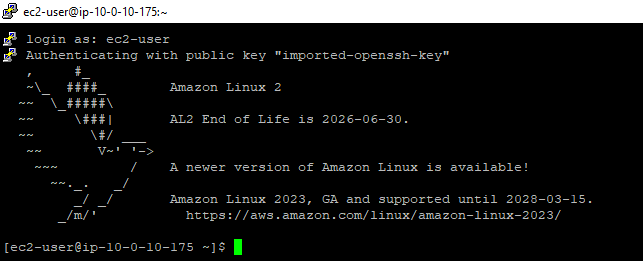
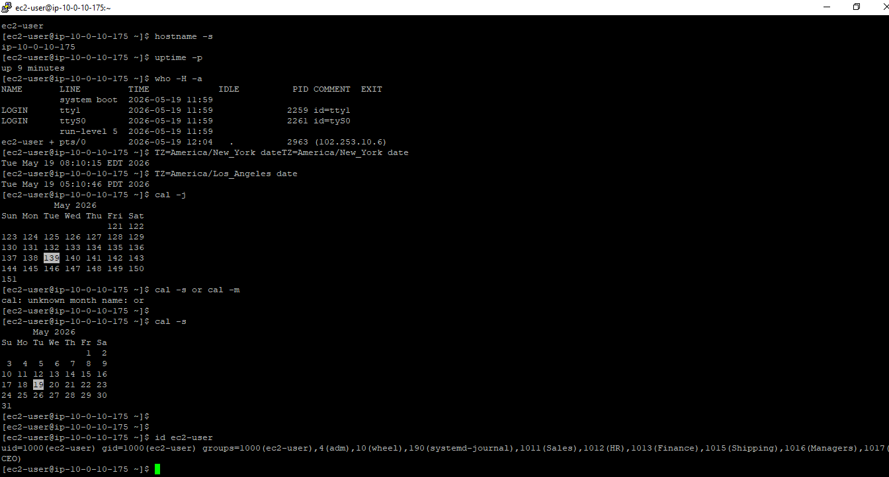
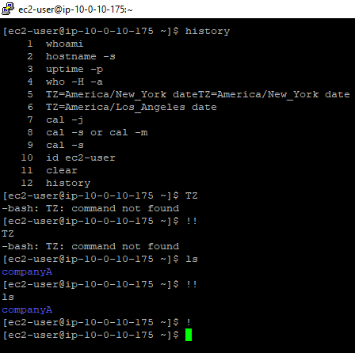

🐧 Linux Command Line — System Info & Bash History

🎯 Objectives
Run commands to gather information about the current system and active session.
Interpret user, host, uptime, date, and identity information from the shell.
Search and recall previous Bash commands using CTRL+R and history
Rerun the most recent command using !!.
Use tab autocomplete to speed up command entry.

Task 1: Use SSH to connect to an Amazon Linux EC2 instance

Task 2: Run familiar commands

Task 3: Improve workflow through history and search

