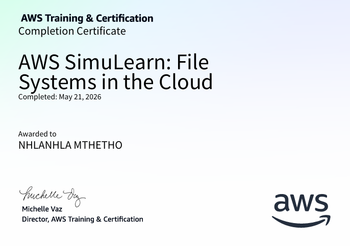

☁️ AWS SimuLearn Lab: Centralized File Storage with Amazon EFS

In this this AWS Lab I was using Amazon EFS to  share files across its branch offices without managing physical storage infrastructure.

🔧 Key Configuration Steps

** Create an EFS File System via the AWS Console
** Configure mount targets in the appropriate VPC subnets
** Set security group rules to allow NFS traffic
** Mount the EFS on each EC2 instance using the amazon-efs-utils package:

💡 Key Takeaways
Amazon EFS is the go-to solution when multiple compute instances need simultaneous, consistent access to the same files.

 
